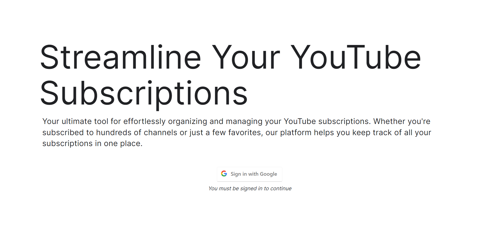
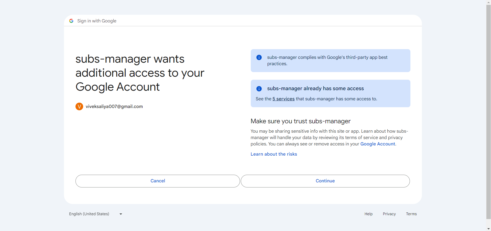
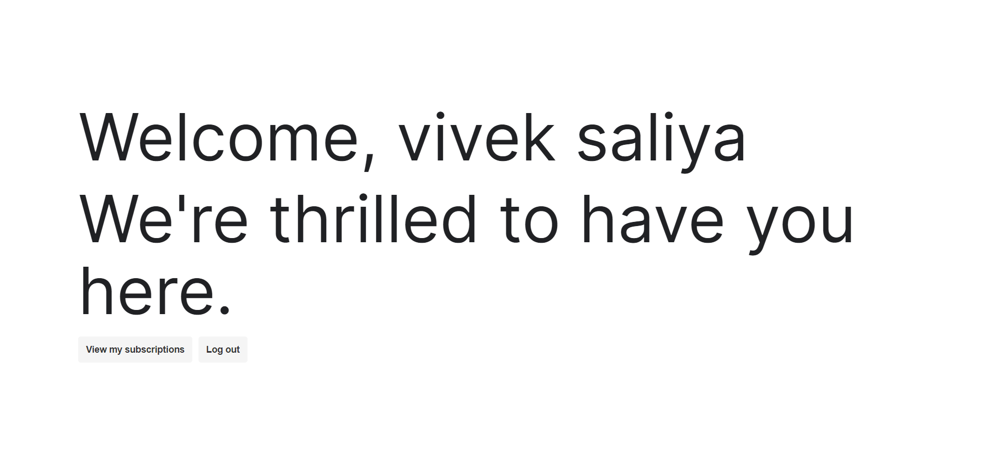
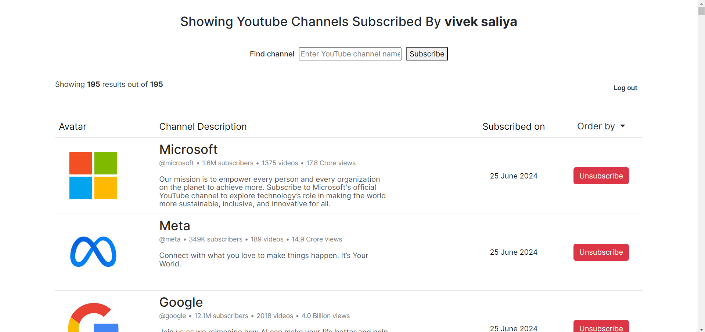

# YouTube Subscription Manager

## Overview

The YouTube Subscription Manager is a web application that allows users to view and manage their YouTube channel subscriptions. Users can search for channels, sort their subscriptions, unsubscribe from channels, and subscribe to new ones directly from the interface.

## Features

unticked boxes shows _feature to be built in the future_

- [x] **View Subscriptions**: Display a list of YouTube channels the user is subscribed to.
- [x] **Sort Subscriptions**: Sort subscriptions by alphabetical order, relevance, or activity.
- [x] **Unsubscribe**: Unsubscribe from channels.
- [x] **Subscribe**: Subscribe to new channels.
- [ ] **Search Channels**: Search for YouTube channels by name or ID.
- [ ] **Pagination**: Load more subscriptions dynamically.

## Technologies Used

- **Backend**: Node.js, Express.js
- **Frontend**: EJS (Embedded JavaScript), Bootstrap
- **YouTube Data API**: To fetch subscription data

## Prerequisites

- Node.js (version 14.x or higher)
- npm (Node Package Manager)

## Screenshots

### Landing Page



### Sign in with Google



### Home Page



### Subscription List



## Installation

1. Clone the repository:

   ```bash
   git clone https://github.com/saliyavivek/youtube-subscription-manager.git

   ```

2. Install dependencies:

   ```bash
   cd youtube-subscription-manager
   npm install

   ```

## Usage

### Set up your Google API credentials:

1. Create a project on the Google Developer Console.
2. Enable the YouTube Data API v3.
3. Create OAuth 2.0 credentials and download the JSON file.
4. Place the JSON file in your project directory and rename it to `credentials.json`.

## Contributing

Contributions are welcome! Please feel free to submit a Pull Request.
